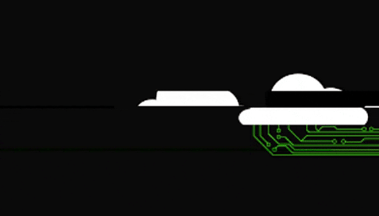

<!-- I followed
https://towardsdatascience.com/build-a-stunning-readme-for-your-github-profile-9b80434fe5d7
and https://github.com/shuhanmirza
and https://github.com/appledora

detailed link is below
-->
<!--
[](https://github.com/mz-tahmeed)
-->

<p align="center">
  
</p>

 <p align="center">
  <a href="https://dev.to/mztahmeed"></a>
  <a href="https://www.linkedin.com/in/zawadtahmeed/"></a>
    <a href="mailto:zawad.ce@gmail.com"></a>
  <a href="https://www.buymeacoffee.com/mztahmeed"></a>
  <a href="https://twitter.com/TahmeedZawad"></a>
</p>

# Hey! Wassup! কিতা অবস্থা! 

My name is Mohammad Zawad Tahmeed. I am a true fan of **Machine Learning**! Love to **automate** everything! I'm from Bangladesh, living in Sylhet and currently working as a Lecturer.


```
- 💻 I’m primarily working on Machine Learning and DeepLearning
- 🌱 I’m currently learning everything 🤣
- 👯 I love collaboration works, so feel free to reach out
- 🥅 2020 Goals: Lear more and Contribute more to Open Source projects
- ⚡ Fun fact: I love to draw
- ⚽ Activity: I love to watch Football
```


## ⚙️ Technologies & Tools
<!-- yellow f6c819 , navy-blue 141452 white fffff -->

<!-- couchdb, django ,flask // freq use -> old use-->

### Frequent 🔥


### Seldom 💤


## Projects 👨‍💻

### Data-Science-Salary-Prediction 📈

<a align="center" href="https://github.com/mz-tahmeed/Data-Science-Salary-Prediction">
  
</a>

### Celebrity-Face-Recognition-Project 🤩

<a align="center" href="https://github.com/mz-tahmeed/Celebrity-Face-Recognition-Project">
  
</a>

<!-- probaho -->

### Pet Projects 🐾

<a align="center" href="https://github.com/mz-tahmeed/Real-Estate-Price-Prediction-Project">
  
</a>

<a align="center" href="https://github.com/mz-tahmeed/Cotton-Disease-Prediction-Project-With-Deep-Learning">
  
</a>

<a align="center" href="https://github.com/mz-tahmeed/Stock-Sentiment-Analysis-Using-News-Headline">
  
</a>

<a align="center" href="https://github.com/mz-tahmeed/Bank-Note-Authentication-with-Docker">
  
</a>

<!-- subsel.org -->

### Gaiming Projects 🎮
<a align="center" href="https://github.com/mz-tahmeed/Flappy-Bird-AI-">
  
</a>

### Automation Projects 🤖
<a align="center" href="https://github.com/mz-tahmeed/Simple-Desktop-File-Organizer">
  
</a>

## &#x1f4c8; GitHub Stats

<p align="center" >
  

  
</p>

<!--
### Wakatime stats

-->


<!--START_SECTION:waka-->
```text
Week: 28 July, 2021 - 03 August, 2021

Other   25 hrs 57 mins  ⣿⣿⣿⣿⣿⣿⣿⣿⣿⣿⣿⣿⣿⣿⣿⣿⣿⣿⣿⣿⣿⣿⣿⣿⣿   100.00 % 
```
<!--END_SECTION:waka-->

<!-- Resources -->
<!-- Icons: https://simpleicons.org/ -->
<!-- GitHub Stats: https://github.com/anuraghazra/github-readme-stats -->
<!-- Emojis: https://emojipedia.org/emoji/ -->
<!-- HTML Emojis: https://www.fileformat.info/index.htm -->
<!-- Shields: https://shields.io/ -->
<!-- Trophies: https://github.com/ryo-ma/github-profile-trophy -->
<!-- Awesome GitHub Profile README: https://github.com/abhisheknaiidu/awesome-github-profile-readme -->

<!--
**mz-tahmeed/mz-tahmeed is special. If you make this a public repository, its README.md will appear on your profile! Send feedback.

Here are some ideas to get you started:

- 🔭 I’m currently working on ...
- 🌱 I’m currently learning ...
- 👯 I’m looking to collaborate on ...
- 🤔 I’m looking for help with ...
- 💬 Ask me about ...
- 📫 How to reach me: ...
- 😄 Pronouns: ...
- ⚡ Fun fact: ...
-->


[atmel-studio-badge]: https://img.shields.io/badge/embedded_system-atmel_avr-f6c819?style=for-the-badge&labelColor=141452&logo=data:image/png;base64,iVBORw0KGgoAAAANSUhEUgAAACAAAAAgCAMAAABEpIrGAAAAAXNSR0IB2cksfwAAAAlwSFlzAAALEwAACxMBAJqcGAAAAe9QTFRF7jIz7jY28JWT8Hhz719b8J+e7kZE8Hhy8u/u8u7t8FZQ70E+8tXR8aCb7klH8tTO8sjE/vLv9YeD8mJd/vPx9cjD8uDa72Zi8U9M/vPv8E9L9YiE+by4+bq29YF87jg2/NvY9Ht396Ke//n3/////erm+8rG7jU1+8vH+bm08EpG//7+8EVD82dl/ebg+bq3+Kaf+KSd+bq4/efh8Vtb70A/8E5L8EQ+7jk38E1L7zw7+Kai/N7a//v6/e3o+sG/82tl95aR/vf1+8zI8EhG+bax/NnV82ln82hl/N3a/evp8VNR96Oe8VhV8VJN/ejl70JA8VpW8ExJ7z47+Kql+r+8+bGs7jY1+bOv//z78EpI/vb0+sG98mBe8VJP9Hh1/uzq/vPw9YJ/8l1Y+8vG8FBO//j383Nu+sfD/vTy9H158EtH8VRR+Kii+8/K9HVz82pm+r248mVh8VhT96Gb/enn/ePd8VNO+a6p/vLu9H137zo4/NnS8EpD9Ht4+baz/ePg+9DO9pCM//r570NB8E1K+Kei/N7b/NXS8EhF83Fs/vXz95uW9o2I9Hp3+r+7//r4/NrZ///+7zs6956Y8VhW95iT8EVE9Hdy/vDt7jg382ll+K+q7z8+9YB8+sbB+sjA70E8/N3X95yZ8VZSW2XAuAAAAWlJREFUeJy1j+VXAlEQxQcTu7t1FBXsRjBAsVsRLMTu7sTu7s4/1N0HHM/ust/0fnh35tzfe28G4M8ksLL+bWxs7TiAvdDB0Vw7OQtdOICrm7uHp7H08vbx9bP0i39AYFBwSGhYeATfHJFRSCk6RsQHxCJRHF8eLzYCYgkPkICJSckpqWmYzgNkZAJkZQPkSHkASa5MjpiXX8CTFyrQJGWRpbyYjlQlpWWUlVdw80pytwqgmvaaWnZeJydAPUADKRrZQJPxd3WzSEMKbQszF7RiW3uHrhP1etOgXUygG3sElPX2mRdBDRPQYT/xAcTBoeGRUcQxJjCOE8QnEadoV6OSCUzjDG2iWZwj/TwuMAHRonYJYJl6YIX0q7jGWnMd0bBBbSBTkP02t7ZZwI5p/t29/QOAw6NjYOvECJye4fmF4VJ1xQHgmgA3t/Qpu+PmAPcPiPLHJyp/frGUA0hf397h4/Pr23L8b/oB+5hNpXmugfUAAAAASUVORK5CYII=

[couchdb-badge]: https://img.shields.io/badge/database-couchdb-f6c819?style=for-the-badge&labelColor=141452&logo=data:image/png;base64,iVBORw0KGgoAAAANSUhEUgAAABQAAAAUCAMAAAC6V+0/AAAAAXNSR0IB2cksfwAAAAlwSFlzAAALEwAACxMBAJqcGAAAAJ9QTFRFAAAA4yQo4yQo4yQo4yQo4yQo4yQo4yQo4yQo4yQo4yQo4yQo4yQo4yQo4yQo4yQo4yQo4yQo4yQo4yQo4yQo4yQo4yQo4yQo4yQo4yQo4yQo4yQo4yQo4yQo4yQo4yQo4yQo4yQo4yQo4yQo4yQo4yQo4yQo4yQo4yQo4yQo4yQo4yQo4yQo4yQo4yQo4yQo4yQo4yQo4yQo4yQo4yQog1Lb/AAAADV0Uk5TAAFSiY+QBJL/BSHhIh2f9qBEtaaApdJzT/H6LjV1ejZV3FZtbvMxWfTWUfXXmf4VZwuHiHRrvr+0AAAAmklEQVR4nKXQyRKCMBBF0WZQniIiiGESnEFFIKD//22GKgrCmrvLqe5ehGhuiqrpiz5dU5XOlgYmGSuBa3OK5kagtbVls3cWkePuPRm9g+sQA3wZxYOR2A3C0cJAXKAIiI9J2pecYiDq8MwuQ+za402+ee/wAWR5OpRnwJNewLsYBwsV+FBZdRvyelVSzXnjt9++9tdwXs/84T8IUBKBIjvf2AAAAABJRU5ErkJggg==
